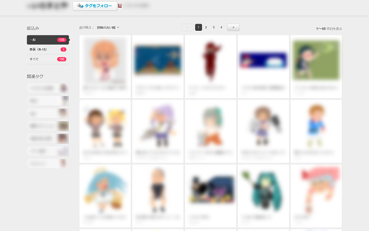
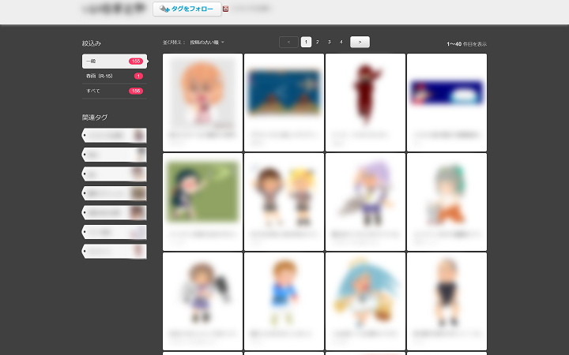

# niconico-usercss
Userstyles to improve UX of NicoNico

### Seiga Illusts into 5 Columns

- Arranges the list of tag's/user's illusts on NicoNico Seiga in 5 columns.
- ニコニコ静画においてタグ・ユーザーのイラスト一覧を 5 列に並べます。

v1.1.1 (2019-06-27)

### Seiga Illusts Dark

- Darker NicoNico Seiga illust pages.
- ニコニコ静画のイラストページを暗めに。

v1.0.0 (2019-06-28)
